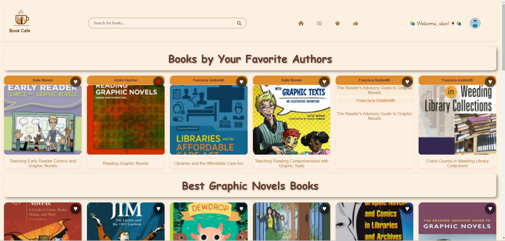

# Book Cafe    

  

## Introduction  

**Book Cafe** is a smart and fast alternative for book lovers who want to save time and avoid endless browsing while searching for their next great read. Leveraging a smart algorithm, Book Cafe instantly brings the latest books and personalized suggestions based on users’ reading tastes. It also provides recommendations from favorite authors, ensuring a tailored and delightful book exploration experience. Another good news is that Book Cafe even offers read online option 

🚀 **Live Demo**: [Book Cafe on Heroku](https://c48-group-b-65d4744c77ac.herokuapp.com/)  

---

## Features  

### 🌟 High-Level Features  

1. **Favourites Page**  
   - Save books to your favorites list for easy access.  

2. **Recommendation Page**  
   - Get personalized book recommendations based on your reading preferences and favorite authors.  

3. **Category Page**  
   - Browse books by genres and categories to explore curated selections.  

4. **Buy Books**  
   - Seamlessly purchase books with integrated purchase links.  

5. **Read Online**  
   - Forgot your ebook or physical book at home? No worries! Book Cafe’s **Read Online** option ensures you can continue enjoying your book anytime, anywhere.  

6. **Search Bar**  
   - Quickly search for books, authors, or categories using the intelligent search functionality.  

---

### 🧠 Smart Algorithm  

Book Cafe’s core strength lies in its **smart algorithm**, implemented with a separation-of-concern approach across both the frontend and backend.  

- **How it works:** The algorithm tracks user interactions, such as liked books and authors, and uses this data to suggest books from similar genres or by the liked authors. This ensures a personalized and engaging experience for every user.  

---

## 🛠️ Technologies Used  

- **Frontend:** React  
- **Backend:** Node.js, Express.js  
- **Database:** MongoDB  
- **Deployment:** Heroku  
- **Cloud Services:** Cloudinary  

---

### Cloudinary Integration  

We integrated **Cloudinary** for managing user profile photos. When a user uploads a profile picture:  
1. The photo is stored in Cloudinary, and the generated URL is saved in the database.  
2. This URL is retrieved and sent to the frontend, ensuring that users see their profile photo every time they log in.  

---

## Conclusion  

Book Cafe combines advanced technology with user-centric design to redefine how readers discover and interact with books.  
Whether you’re looking for your next read, browsing your favorite categories, or simply continuing to read online, Book Cafe handles everything, so you don’t have to miss a moment of your reading joy.  

We welcome your feedback and suggestions to enhance this platform even further.  
